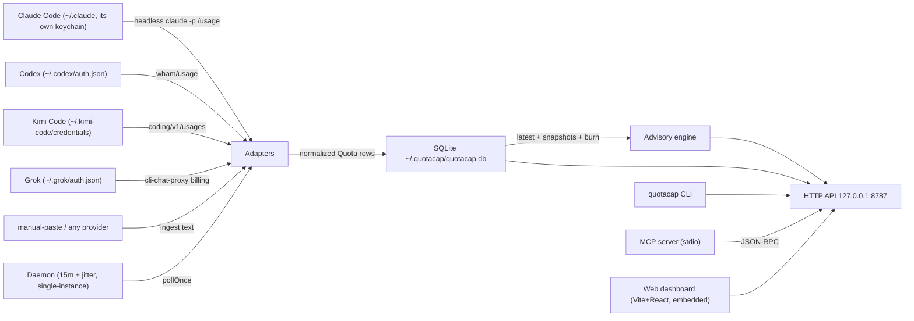

# QuotaCap Architecture

**Abstract.** QuotaCap is a local cross-harness quota dashboard and advice tool. One daemon polls every AI CLI on the machine and stores each usage snapshot in SQLite. The same HTTP API serves a CLI, an MCP server, and a web dashboard. It answers one question: which provider should you use next to end the week near 100% instead of wasted? Setup is zero, and API keys are never needed. This document describes the components, the data flow, the on-disk state, and the main commands. It is for new contributors and for users deciding what quotacap can do.

## Position

Four AI coding CLIs (Claude Code, Codex, Kimi Code, Grok) share this machine. Each has its own weekly quota that resets on its own schedule. Running out early on one is fine; ending the week with a half-used subscription is waste. QuotaCap watches all of them from the outside:

- No hosted service, no account — everything lives in `~/.quotacap/` (SQLite, config, pidfile, logs).
- No API keys — adapters reuse the OAuth sessions the CLIs already store at login.
- Every surface (CLI, MCP, web) is a view over the same HTTP handler, so a harness asking "what should I use next?" gets the same answer the dashboard shows.

## Components

| Component | Responsibility | Key files |
|---|---|---|
| Adapters | Poll one CLI for its current usage snapshot (used %, reset time, plan). Fail closed: degraded row, never a crashed poll. | `src/adapters/claude.ts`, `codex.ts`, `kimi.ts`, `grok.ts`, `manual.ts`, `types.ts` |
| Adapter core | Shared HTTP + token plumbing: JSON fetch with 8s timeout, OAuth refresh with a stored refresh_token, atomic persist of rotated tokens with a one-time backup. | `src/adapters/core.ts` |
| Store | SQLite schema + inserts: append-only `quotas` rows per poll, daily `snapshots`, latest-per-provider lookups, 24h rolling burn rate. | `src/store/db.ts`, `src/store/quotas.ts` |
| Daemon | The poll loop: `pollOnce` every 15m + jitter, `Promise.allSettled` isolation, single-instance pidfile guard, keepalive until SIGINT/SIGTERM. | `src/daemon.ts` |
| Advisory engine | Ideal daily burn, burn verdict (fast/slow), waste-if-unused, and the "use X next" recommendation. | `src/advisory/engine.ts`, `src/advisory/types.ts` |
| HTTP server | Fastify app: `/health`, `/api/quotas`, `/api/recommendation`, `POST /api/refresh`, `/`, `/assets/*` (embedded dashboard). Bound to `127.0.0.1:8787`. | `src/http/server.ts` |
| CLI | Commander-based surface: `status`, `advise`, `ingest`, `web`, `daemon`, `init`, `mcp`, `version`. | `src/cli/index.ts` |
| MCP server | stdio JSON-RPC: `initialize`, `tools/list`, `tools/call` (`get_quotas`, `get_recommendation`, `forecast`), `ping`. Wraps the same HTTP handler; translates daemon-down into a readable error. | `src/mcp/server.ts` |
| Web dashboard | Vite + React (design D: summary banner, 7-day strip, quota table, collapsible rows). `web/dist` is embedded into the binary at build. | `web/` |
| Format layer | Shared table renderer used by CLI and MCP: reset date formatting (month name + local time), burn glyphs, alignment guards. | `src/format/table.ts`, `src/format/parse.ts` |
| Config | Zod-validated `~/.quotacap/config.json`: `port: 8787`, `pollMinutes: 15`, `enabledProviders: ["claude","codex","kimi","grok"]`. No secrets — credentials live side-by-side with each CLI. | `src/config.ts` |

## System diagram



Everything to the left is one local process (`quotacap daemon`, or `quotacap web` which auto-starts it). The MCP and CLI processes are separate — they call the HTTP API on demand.

## Data model

Two tables in `~/.quotacap/quotacap.db`:

```sql
quotas(id INTEGER PRIMARY KEY, provider TEXT, plan TEXT, used_pct REAL,
       resets_at TEXT, period_start TEXT, raw TEXT, source TEXT, fetched_at TEXT)

snapshots(day TEXT, provider TEXT, used_pct REAL, burn_rate REAL,
          ideal_rate REAL, PRIMARY KEY(day, provider))
```

- `quotas` is append-only polling history — one row per provider per poll. Burn rate is a used-pct delta over a real rolling window of this history (up to 24h). See `getBurnRates` in `src/store/quotas.ts`. The rolling window means calendar-day boundaries and poll timing cannot skew it.
- `snapshots` is the per-day roll-up feeding the 7-day strip.
- The `Quota` shape is `{ provider, plan, usedPct, resetsAt, periodStart, raw, source, fetchedAt }` — the same shape on every surface (`src/adapters/types.ts`).

## Poll cycle

1. Daemon wakes on `pollMinutes` + jitter, and on `POST /api/refresh` (60s debounce).
2. `pollAll(enabledProviders)` runs each adapter with an 8s timeout, isolated by `Promise.allSettled`. One broken provider (timeout, 401) becomes a degraded row, never a failed poll.
3. Adapter reads its CLI's credential file. If the access token is expired it refreshes via OAuth and persists the rotated pair atomically. Never-logged-in providers report degraded instead of crashing.
4. Snapshots are normalized to `Quota`, upserted into `quotas` + `snapshots`.
5. Advisory computes ideal daily burn (used-pct remaining ÷ days left), burn verdict (actual vs ideal − fast/slow), waste-if-unused, and the single next-provider recommendation.
6. CLI/`advise`, MCP, and the dashboard all read the same `/api/recommendation`.

## Main commands

| Command | What it does | Example |
|---|---|---|
| `status [--json]` | Latest per-provider table: used, left, resets, days left, ideal burn, burn rate, waste. Reads the DB (no network). | `quotacap status` |
| `advise [--task <any\|heavy\|light>]` | "Use X next" — HTTP API with in-process fallback. | `quotacap advise --task heavy` |
| `ingest --provider <p> --text <t>` | Manual quota paste for providers without an adapter. | `quotacap ingest --provider agy --text "65% used · resets Sep 1"` |
| `web [--port <n>]` | Serve the dashboard on :8787, auto-starting the daemon if none is running. | `quotacap web` |
| `daemon [--foreground]` | Run the daemon in foreground (default), polling `enabledProviders`. | `quotacap daemon` |
| `init` | Write `~/.quotacap/config.json` with defaults. | `quotacap init` |
| `mcp` | Start the MCP stdio server for harness integration. | `quotacap mcp` |
| `version` | Print the version. | `quotacap version` |

## Distribution

- npm package `quotacap` (`npx quotacap` / `npm i -g quotacap`) — `web/dist` embedded, so the single package installs the dashboard via the bundle.
- Bun single-file binary via `npm run build:bin` (`bun build --compile`) — same embedded bundle, no filesystem dependencies.
- Homebrew tap and `go install` considered. No hosted service.

## Security model

- Bound to `127.0.0.1` — no LAN access, no web-facing surface.
- No secrets stored by quotacap: adapters read the OAuth files the CLIs already own (`~/.codex/auth.json`, `~/.kimi-code/credentials/kimi-code.json`, `~/.grok/auth.json`, `~/.gemini/oauth_creds.json` for the deferred Antigravity path).
- Token refresh rotates the pair and persists it atomically. One backup file is kept before the first rotation. Tokens are never logged: `raw` on a row holds the usage payload, not credentials.
- Fail-closed adapters: an outage or revoked login shows as a degraded row, never as a misleading "0% used".

## Related

- `docs/ROADMAP.md` — shipped, next, future, parked.
- Design + implementation plan live in the private workbench repo (`carlosboeing/quotacap-workbench`): `.workbench/2-design/2026-08-28-quotacap-design.md`, `.workbench/3-plans/2026-08-28-quotacap-mvp-plan.md`.
