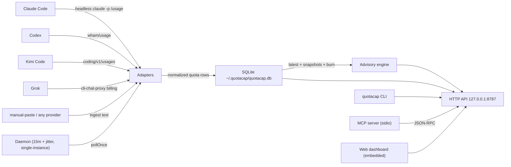

# QuotaCap Architecture

**Abstract.** QuotaCap helps you maximize the AI coding subscriptions you already pay for (Claude, Codex, Kimi, Grok). Each has its own quota and reset time. It gives you visibility into usage, remaining, and reset in one table, and recommends which one to use next so unused quota does not expire and you do not hit a cap too early. A single daemon polls every supported coding agent and stores each usage snapshot in SQLite (an embedded database). One local HTTP API serves a CLI, an MCP server, and a web dashboard. Setup is zero, and no API keys are ever needed. This document describes the components, the data flow, the on-disk state, and the main commands.

## Position

Claude Code, Codex, Kimi Code, and Grok are popular AI coding agents. Each has its own usage quota and reset time. Several subscriptions means unused quota on one, a cap hit too early on another, and reset dates that do not line up. QuotaCap puts usage, remaining, and reset in one view, and says which provider to use next:

- Local and self-contained. Everything lives in `~/.quotacap/`: config, database, pidfile, logs.
- Zero-config credentials. Adapters reuse the OAuth sessions the agents already store on first login.
- One handler behind every surface. The CLI, the MCP server, and the web dashboard all read the same HTTP API. An agent asking "what should I use next?" gets the same answer the dashboard shows.

## Components

| Component | Responsibility | Key files |
|---|---|---|
| Adapters | Poll one agent CLI for its current usage snapshot (used %, reset time, plan). Fail closed: a failing provider becomes a degraded row, never a broken poll. | `src/adapters/claude.ts`, `codex.ts`, `kimi.ts`, `grok.ts`, `manual.ts`, `types.ts` |
| Adapter core | Shared HTTP and token plumbing. JSON fetch with an 8s timeout, OAuth refresh using the stored refresh token, in-place save of the new token pair with one backup copy. | `src/adapters/core.ts` |
| Store | Schema and inserts. Append-only `quotas` rows per poll, daily `snapshots`, latest-per-provider lookups, and the 24h rolling burn rate. | `src/store/db.ts`, `src/store/quotas.ts` |
| Daemon | The poll loop. `pollOnce` every 15 minutes plus jitter, `Promise.allSettled` isolation, single-instance pidfile guard, keeps running until SIGINT or SIGTERM. | `src/daemon.ts` |
| Advisory engine | Ideal daily burn, burn verdict (fast or slow), waste-if-unused, and the "use X next" recommendation. | `src/advisory/engine.ts`, `src/advisory/types.ts` |
| HTTP server | Fastify app. Routes: `/health`, `/api/quotas`, `/api/recommendation`, `POST /api/refresh`, `/`, `/assets/*` (embedded dashboard). Bound to `127.0.0.1:8787`. | `src/http/server.ts` |
| CLI | Commander-based surface. Commands: `status`, `advise`, `ingest`, `web`, `daemon`, `init`, `mcp`, `version`. | `src/cli/index.ts` |
| MCP server | stdio JSON-RPC server. Methods: `initialize`, `tools/list`, `tools/call` (`get_quotas`, `get_recommendation`, `forecast`), `ping`. Calls the same HTTP handler and translates a down daemon into a readable error. | `src/mcp/server.ts` |
| Web dashboard | Vite and React. Summary banner, 7-day strip, quota table, collapsible rows. Built at publish time and embedded into the package. | `web/` |
| Format layer | Shared table renderer for CLI and MCP. Reset dates as month name plus local time, burn glyphs, alignment. | `src/format/table.ts`, `src/format/parse.ts` |
| Config | Zod-validated `~/.quotacap/config.json`. Defaults: `port: 8787`, `pollMinutes: 15`, `enabledProviders: ["claude","codex","kimi","grok"]`. No secrets; credentials stay with each CLI. | `src/config.ts` |

## System diagram



The daemon, adapters, store, advisory engine, and HTTP API form one local process. The CLI and MCP server are separate processes. They call the HTTP API on demand.

## Data model

Two tables in `~/.quotacap/quotacap.db`:

```sql
quotas(id INTEGER PRIMARY KEY, provider TEXT, plan TEXT, used_pct REAL,
       resets_at TEXT, period_start TEXT, raw TEXT, source TEXT, fetched_at TEXT)

snapshots(day TEXT, provider TEXT, used_pct REAL, burn_rate REAL,
          ideal_rate REAL, PRIMARY KEY(day, provider))
```

- `quotas` is append-only polling history — one row per provider per poll. Burn rate is a used-pct delta over a real rolling window of that history (up to 24h). See `getBurnRates` in `src/store/quotas.ts`. The rolling window keeps calendar-day boundaries and poll timing from skewing it.
- `snapshots` is the per-day roll-up that feeds the 7-day strip.
- The `Quota` shape is `{ provider, plan, usedPct, resetsAt, periodStart, raw, source, fetchedAt }` — identical on every surface (`src/adapters/types.ts`).

## Poll cycle

1. The daemon wakes on the poll interval plus jitter, and on `POST /api/refresh` (60s debounce).
2. `pollAll(enabledProviders)` runs each adapter with an 8s timeout, isolated by `Promise.allSettled`. A provider that times out or returns 401 becomes a degraded row.
3. The adapter reads its CLI's credential file. An expired access token is refreshed via OAuth and the new pair is saved in place. A provider that was never signed in reports degraded instead of failing the poll.
4. Snapshots normalize to `Quota` and upsert into `quotas` and `snapshots`.
5. The advisory engine computes ideal daily burn (remaining % ÷ days left), the slow-or-fast verdict, waste-if-unused, and one next-provider recommendation.
6. CLI `advise`, MCP, and the dashboard all read the same `/api/recommendation`.

## Main commands

| Command | What it does | Example |
|---|---|---|
| `status [--json]` | Latest per-provider table: used, left, resets, days left, ideal burn, burn rate, waste. Reads the database; no network. | `quotacap status` |
| `advise [--task <any\|heavy\|light>]` | "Use X next." HTTP API first, in-process fallback. | `quotacap advise --task heavy` |
| `ingest --provider <p> --text <t>` | Manual quota paste for providers without an adapter. | `quotacap ingest --provider agy --text "65% used · resets Sep 1"` |
| `web [--port <n>]` | Serve the dashboard on :8787 and auto-start the daemon if none is running. | `quotacap web` |
| `daemon [--foreground]` | Run the daemon in the foreground (default) and poll `enabledProviders`. | `quotacap daemon` |
| `init` | Write `~/.quotacap/config.json` with defaults. | `quotacap init` |
| `mcp` | Start the MCP stdio server for harness integration. | `quotacap mcp` |
| `version` | Print the version. | `quotacap version` |

## Distribution

- npm package `quotacap` (`npx quotacap` or `npm i -g quotacap`). The dashboard is embedded, so a single package gives you the CLI, MCP, daemon, and dashboard with no extra install.
- Bun single-file binary via `npm run build:bin`. Same embedded bundle; nothing on disk besides the user data directory.

## Security model

- Bound to `127.0.0.1` — no LAN access, no publicly reachable surface.
- QuotaCap stores no secrets. Adapters read the OAuth files the agents already own. Each CLI writes its own file (`~/.codex/auth.json`, `~/.kimi-code/credentials/kimi-code.json`, `~/.grok/auth.json`, and `~/.gemini/oauth_creds.json` for the deferred Antigravity path).
- When the access token stops working, the adapter asks the provider for a new one and writes it to the same file. The previous file is kept once, before the change. The file contents never go into logs.
- Fail-closed adapters. A service outage or a revoked login surfaces as a degraded row, never as a misleading "0% used".

## Related

- [`docs/ROADMAP.md`](ROADMAP.md) — shipped, next, future, and parked work.
- [`github.com/carlosboeing/quotacap`](https://github.com/carlosboeing/quotacap) — repository, issues, and releases.
