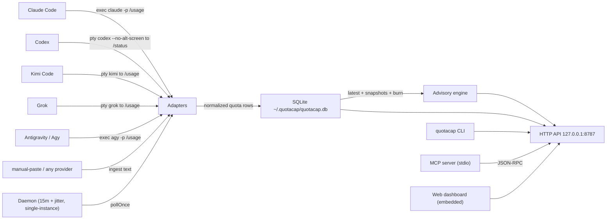

# QuotaCap architecture

**Abstract.** QuotaCap is a local tracker that records one current usage window for each supported AI coding plan and estimates which plan to use next from remaining usage and recent pace when available. A single daemon polls providers, stores snapshots in SQLite, and serves the same data through a local HTTP API, CLI, MCP server, and web dashboard. This document explains the system components, data flow, stored state, security model, and commands for contributors.

## Position

Claude Code, Codex, Kimi Code, Grok, and Antigravity can expose multiple concurrent usage limits with different reset times. QuotaCap currently normalizes one usage window per provider. Across several subscriptions, this can reveal unused allowance on one plan and an early-limit risk on another. QuotaCap estimates which provider to use next from remaining usage and recent pace when available:

- Local and self-contained. Everything lives in `~/.quotacap/`: config, database, pidfile, token.
- Credential-free. QuotaCap owns no tokens. It invokes the CLIs you already logged into and parses their output. It never reads `~/.codex/auth.json`, `~/.kimi-code/credentials/kimi-code.json`, `~/.grok/auth.json`, or any `refresh_token` flow. Those paths are no longer read since #14. No separate API keys.
- One handler behind every surface. The CLI, the MCP server, and the web dashboard all read the same HTTP API. An agent asking "what should I use next?" gets the same answer the dashboard shows.

## Components

| Component | Responsibility | Key files |
|---|---|---|
| Adapters | Poll one agent CLI for its current usage snapshot (% used, reset time, plan). `claude` and `agy` use `execFile`. `codex`, `kimi`, `grok` use a PTY. Each adapter fails closed. PTY adapters are TUI-fragile. Poll latency is 2–10 s. `agy` emits two rows: `agy` and `agy:3p`. | `src/adapters/claude.ts`, `agy.ts`, `codex.ts`, `kimi.ts`, `grok.ts`, `manual.ts`, `types.ts` |
| PTY runner | Generic PTY session. It spawns via `node-pty`. It waits for readiness or a settle delay. It sends input with `\r`. It collects until a completion regex or timeout. It caps at 256 KiB and kills clean. | `src/adapters/pty.ts` |
| Store | Schema and inserts. Append-only `quotas` rows per poll, daily `snapshots`, latest-per-provider lookups, and the 24-hour rolling usage pace. No `raw` column. `credits_usd` and `resets_at_estimated` on `quotas`. Dir `0700`, file `0600`. | `src/store/db.ts`, `src/store/quotas.ts` |
| Daemon | The poll loop. `pollOnce` every 15 minutes plus jitter. `Promise.allSettled` isolation. Single-instance `O_EXCL` pidfile with stale-steal. Pinned `claude` binary at start. Runs until SIGINT or SIGTERM. | `src/daemon.ts` |
| Advisory engine | Target daily usage, recent or estimated pace, early-limit risk, projected unused allowance at reset, and the next-provider estimate. | `src/advisory/engine.ts`, `src/advisory/types.ts` |
| HTTP server | Fastify app. Routes: `/health`, `/api/quotas`, `/api/recommendation`, `GET /api/token`, `POST /api/refresh`, `/`, `/assets/*`. Bound to `127.0.0.1:8787`. `Host` and `Origin` allowlists. `X-QuotaCap-Token` on mutating routes. Rooted asset serving. | `src/http/server.ts` |
| CLI | Commander-based surface. Commands: `status`, `advise`, `ingest`, `web`, `daemon`, `init`, `mcp`, `version`. | `src/cli/index.ts` |
| MCP server | stdio JSON-RPC server. Methods: `initialize`, `tools/list`, `tools/call` (`get_quotas`, `get_recommendation`, `forecast`), `ping`. Calls the same HTTP handler and translates a down daemon into a readable error. | `src/mcp/server.ts` |
| Web dashboard | Vite and React. Summary banner, 7-day strip, quota table, collapsible rows. Built at publish time and embedded into the package. | `web/` |
| Format layer | Shared table renderer for CLI and MCP. Reset dates as month name plus local time, burn glyphs, alignment. | `src/format/table.ts`, `src/format/parse.ts` |
| Config | Zod-validated `~/.quotacap/config.json`. Defaults: `port: 8787`, `pollMinutes: 15`, `enabledProviders: ["claude","codex","kimi","grok","agy"]`. No secrets; credentials stay with each CLI. | `src/config.ts` |

## System diagram



The daemon, adapters, store, advisory engine, and HTTP API form one local process. The CLI and MCP server are separate processes. They call the HTTP API on demand.

## Data model

Two tables in `~/.quotacap/quotacap.db`:

```sql
quotas(id INTEGER PRIMARY KEY, provider TEXT, plan TEXT, used_pct REAL,
       resets_at TEXT, period_start TEXT, source TEXT, fetched_at TEXT,
       credits_usd REAL, resets_at_estimated INTEGER)

snapshots(day TEXT, provider TEXT, used_pct REAL, burn_rate REAL,
          ideal_rate REAL, PRIMARY KEY(day, provider))
```

- `quotas` is append-only polling history: one row per provider per poll. The recent usage pace is the percentage-point change over a rolling window of up to 24 hours. See `getBurnRates` in `src/store/quotas.ts`. The rolling window keeps calendar-day boundaries and poll timing from skewing it. The `raw` column was dropped in `src/store/db.ts:37-48`. A migration rebuilds an old `raw` table and preserves rows.
- `snapshots` is the per-day roll-up that feeds the 7-day strip.
- The `Quota` shape is `{ provider, plan, usedPct, sessionPct?, resetsAt, periodStart, source, fetchedAt, creditsUsd?, resetsAtEstimated? }`. No `raw` field crosses the store or API boundary (`src/store/quotas.ts:18`, `src/adapters/types.ts`). `ParsedQuota` keeps an in-memory `raw` slice (up to 4096 chars) for debugging only. `GET /api/quotas` and MCP `get_quotas` never return `raw` (`tests/http/api.test.ts`, `tests/store/db.test.ts`).

## Poll cycle

1. The daemon wakes on the poll interval plus jitter, and on `POST /api/refresh` (60s debounce).
2. `pollAll(enabledProviders)` runs each adapter isolated by `Promise.allSettled` with a per-adapter timeout. Timeouts are `claude` 8 s, `codex` 12 s, `kimi` 8 s, `grok` 14 s, `agy` 20 s (`src/adapters/index.ts:18`). A timeout or parse failure becomes a degraded row. It never becomes a misleading "0% used".
3. Adapter mechanisms — credential-free, no token ownership:
   - `claude`, `agy`: use `execFile` with an argv list. No shell. `claude` is pinned at daemon start via `which claude` (`src/daemon.ts:resolveClaudeExecPath`). `claude` runs `claude -p /usage --output-format json`. `agy` runs `agy -p /usage --output-format json`. `claude` parses week and session percents. `agy` parses `groups[].buckets[]` JSON and emits two rows: `agy` and `agy:3p`. Both use `source: "cli"`.
   - `codex`, `kimi`, `grok`: use `runPty` (`src/adapters/pty.ts`). The runner spawns the CLI in a PTY via `node-pty`. It waits a settle delay (`codex` 2 s, `grok` 5 s) or a readiness regex (`kimi`). It writes `/status` or `/usage` plus `\r`. It collects until a completion regex or timeout. It caps at 256 KiB and kills clean. Parsers are TUI-fragile. A vendor text change breaks the regex. The row then degrades fail-closed until the pattern is fixed. Poll latency is 2–10 s. It dominates `POST /api/refresh` and the first poll. It does not affect the steady-state 15 m timer. These adapters use `source: "tui"`. They abort fail-closed on trust prompts without auto-trusting.
   - No adapter reads `~/.codex/auth.json`, `~/.kimi-code/credentials/kimi-code.json`, `~/.kimi/credentials/kimi-code.json`, `~/.grok/auth.json`, or `~/.gemini/oauth_creds.json`. No adapter uses `refresh_token` or `grant_type=refresh_token`. No hardcoded `client_id` remains. This is asserted by `tests/adapters/credential-free.test.ts`. No `.qc-bak` or `.qc-lock` writes exist since #14. Manual providers still use `ingest`.
4. Snapshots normalize to `Quota` and upsert into `quotas` and `snapshots`.
5. The advisory engine computes target daily usage (remaining % ÷ days left), recent or estimated pace, early-limit risk, projected unused allowance at reset, and one next-provider estimate.
6. CLI `advise`, MCP, and the dashboard all read the same `/api/recommendation`.

## Main commands

| Command | What it does | Example |
|---|---|---|
| `status [--json]` | Latest per-provider table: used, left, resets, days left, ideal burn, burn rate, waste. Reads the database; no network. | `quotacap status` |
| `advise [--task <any\|heavy\|light>]` | "Use X next." HTTP API first, in-process fallback. | `quotacap advise --task heavy` |
| `ingest --provider <p> --text <t>` | Manual quota paste for providers without an adapter. | `quotacap ingest --provider myplan --text "65% used · resets Sep 1"` |
| `web [--port <n>]` | Serve the dashboard on :8787 and auto-start the daemon if none is running. | `quotacap web` |
| `daemon [--foreground]` | Run the daemon in the foreground (default) and poll `enabledProviders`. | `quotacap daemon` |
| `init` | Write `~/.quotacap/config.json` with defaults. | `quotacap init` |
| `mcp` | Start the MCP stdio server for harness integration. | `quotacap mcp` |
| `version` | Print the version. | `quotacap version` |

## Distribution

- npm package `quotacap` (`npx quotacap` or `npm i -g quotacap`). The dashboard is embedded, so a single package gives you the CLI, MCP, daemon, and dashboard with no extra install.
- Bun single-file binary via `npm run build:bin`. Same embedded bundle; nothing on disk besides the user data directory. `node-pty` is an `optionalDependency`. Exec adapters (`claude`, `agy`) work without it. PTY adapters (`codex`, `kimi`, `grok`) report `node-pty not available` and degrade gracefully.

## Security model

- Loopback bind only. `web` and `daemon` listen on `host: "127.0.0.1"` (`src/cli/index.ts:56`). No `0.0.0.0`. No LAN surface. State lives under `~/.quotacap/` with `0700` on the directory and `0600` on `config.json`, `quotacap.db`, and `token` (`src/store/db.ts:openDb`, `src/http/server.ts:ensureToken`, `src/daemon.ts:ensureDaemonToken`).
- No tokens owned, no credential files touched. QuotaCap never reads `~/.codex/auth.json`, `~/.kimi-code/credentials/kimi-code.json`, `~/.kimi/credentials/kimi-code.json`, `~/.grok/auth.json`, or `~/.gemini/oauth_creds.json`. It never uses `refresh_token` or `grant_type=refresh_token`. It has no hardcoded client ids. The old OAuth paths and the `.qc-bak` and `.qc-lock` and `persistCreds` helpers were removed in #14. This is asserted by `tests/adapters/credential-free.test.ts`. Each CLI owns its own session. QuotaCap only spawns the CLI and reads its stdout.
- `raw` not stored. The `raw` column is not present in the schema. Older databases are migrated by rebuilding the table in `src/store/db.ts:37-48`. `mapRow` deletes `raw` (`src/store/quotas.ts:18`). `getAllLatest` and `GET /api/quotas` and MCP `get_quotas` never return it. This is covered by `tests/http/api.test.ts` and `tests/store/db.test.ts`. Provider identity fields are not persisted. They are not served over HTTP. They are not handed to model context. `ParsedQuota.raw` is an in-memory debug slice (4096 chars) that is never written to disk.
- Host, Origin, and token locked. Every request is gated by an `onRequest` hook (`src/http/server.ts:111-119`). `Host` must be `127.0.0.1`, `localhost`, `[::1]`, or `::1` with or without port. Otherwise the server returns `403 forbidden host`. This blocks DNS rebinding. `Origin` when present must be `http://` or `https://` with a loopback hostname. Otherwise it returns `403 forbidden origin`. Absent `Origin` passes for `curl`, CLI, and MCP. `POST /api/refresh` requires `X-QuotaCap-Token` matching `~/.quotacap/token` (`0600`). The compare uses `crypto.timingSafeEqual` (`src/http/server.ts:isValidToken`). Otherwise it returns `401`. `GET /api/token` is same-origin gated. Refresh is debounced to 60 s.
- Rooted `GET /assets/*`. The handler decodes the splat. It rejects `..` and absolute paths. It resolves with `path.resolve(root, decoded)`. It requires the candidate to stay under the assets root (`src/http/server.ts:188-215`). `GET /assets//etc/passwd` returns `400` (`tests/http/api.test.ts`).
- Fail-closed and least privilege. `execFile` and `runPty` use argv lists. No shell strings. A timeout or unmatched TUI text degrades to a stale row. It never becomes `0% used`. `daemon.pid` is acquired with `O_EXCL` and a liveness check. It steals only stale dead pids (`src/daemon.ts:acquirePidFile`). `claude` is pinned to the absolute path resolved at daemon start. This avoids `PATH` hijack on each poll.

See also [`SECURITY.md`](../SECURITY.md) for reporting and the full "what QuotaCap does and does not touch" list, and [`docs/ROADMAP.md`](ROADMAP.md) for shipped hardening items.

## Related

- [`docs/ROADMAP.md`](ROADMAP.md): shipped, next, future, and parked work.
- [`github.com/carlosboeing/quotacap`](https://github.com/carlosboeing/quotacap): repository, issues, and releases.
